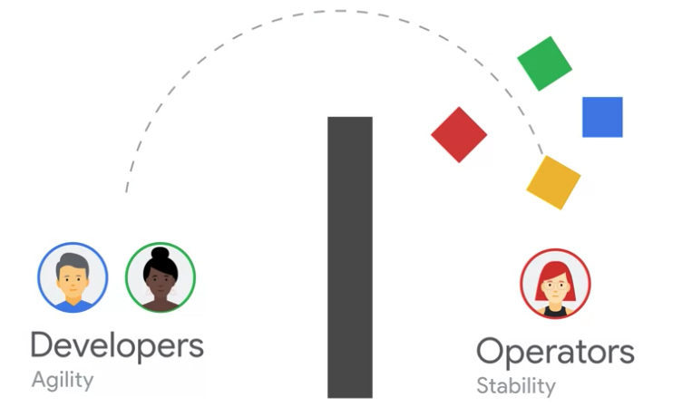
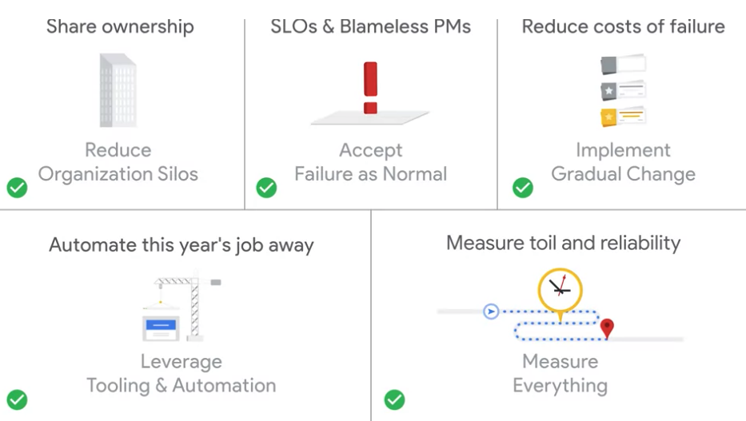
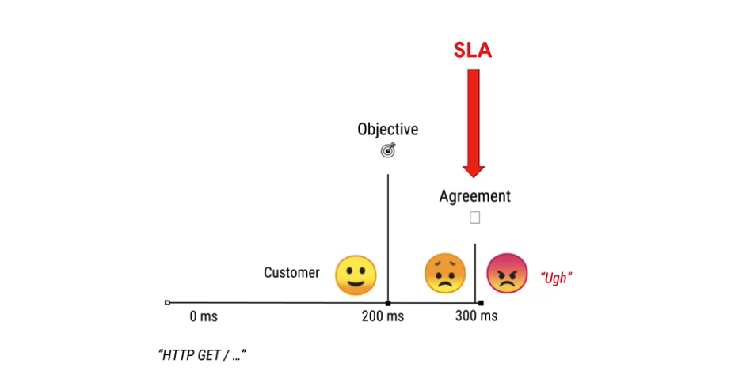
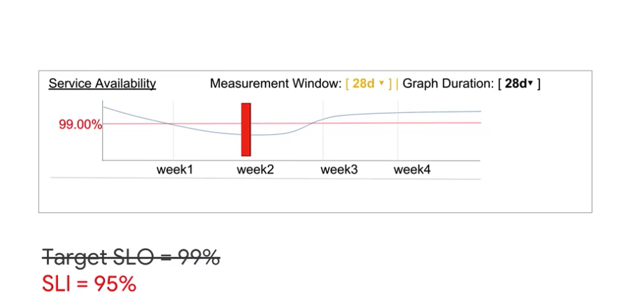
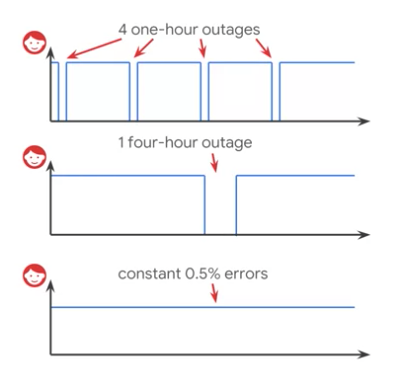
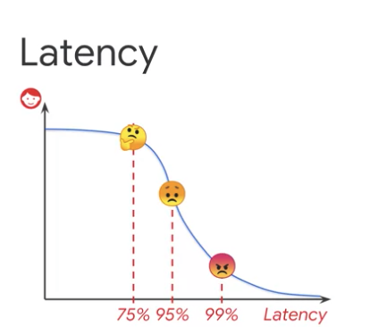
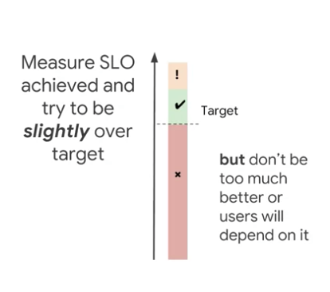
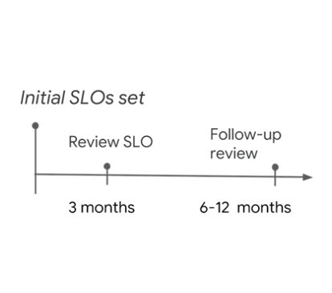
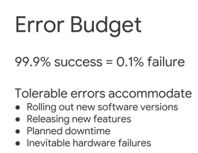
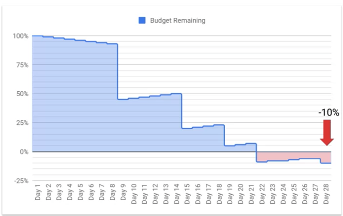

<b>Reliability is the most important feature of your system.</b>

# Targeting Reliability
## SRE vs DevOPS
PS: 
***First understand what Devops is?***



- Developers used to throw their code over the metaphorical wall and operators were responsible for keeping that code running in production. 
- Operators had little understanding of the code bases and developers had little understanding of operational practices,
- But developers were concerned with shipping code and operators were concerned with reliability. This misalignment often caused tension within the organization.

***Summary***

> The developers were responsible for features and the operators were responsible for stability, meaning the developers wanted to move faster to get their features out faster and the operators wanted to move slower to keep things stable I can see how that would cause a lot of tension. 

<b>So DevOps is a set of practices and a culture designed to break down those barriers between developers, operators and other parts of the organization We can break DevOps down into five key areas. </b>

- ***Reduce organization silos*** by breaking down barriers across teams we can increase collaboration and thorough put.
- ***Accept failure as normal***, computers are inherently unreliable so we can't expect perfection and when we introduce humans into the system we get even more imperfection.
- ***Implement gradual change***, not only are small, incremental changes easier to review, but in the event that a gradual change does make a bug in production, it allows us to reduce our meantime to recover, making it simple to roll back. 
- ***Leverage tooling and automation***, we need to leverage it.
- ***Measure everything***, measurement is a critical gauge for success and without a way to measure if our first four pillars were successful, we would have no way of knowing if they were

***Do DevOps Aligns with SRE***
It's sounding very familiar because if you think about DevOps as a philosophy, SRE is a prescriptive way of accomplishing that philosophy so if DevOps were an interface and programming language, you might almost say that SRE is a concrete class that implements DevOps

***From SRE Points of View to DevOps Categories***



- ***Reduce organization silos*** We share ownership of production with our developers and we use the same tooling in order to make sure everyone has the same view and same approach to working with production. 

- ***Accept failure as normal*** We have blameless postmortems where we make sure that the failures that happen in our production systems don't happen the exact same way more than once and we accept the failures as normal by encoding a concept of an error budget, of how much the system is allowed to go out of spec. 

- ***Implement gradual change*** We can carry things that we roll things out to a small percentage of the fleet before we move them out for all users

- ***Leverage tooling and automation*** We try to eliminate manual work as much as possible so, we measure how much toil we have and then we try to automate this year's job away

<b>
DevOps and SRE aren't two competing methods, but rather close friends designed to help break down organizational barriers to deliver better software faster.
</b>

## CRE (Customer Reliability Engineering)
CRE is about teaching customer how to do DevOps and SRE. We have an API and the customers connect our servers. This is why we need CRE.

<p>

For years we learned hard lessons.
Customers had problems and they had problems because they had used their systems in ways that we weren't expecting and that neither of us were communicating about. We didn't tell our customers how our systems were designed and they didn't tell us what they were expecting. And then when everything broke they got very upset. And you can imagine that multiplied by millions or billions of users. 

And we learned eventually that we can move faster and ship features to our customers faster if we're openly communicating with our customers. And helping them do SRE so the time that we spend teaching people about how to do SRE what is it paying off a lot?

***What CRE teams do in Google***

CREs are regular google SREs that are focused externally. Instead of working on our own GCP applications, we instead help customers who are implementing their applications on GCP. And we help them also implement SRE practices like SLIs and SLOs. And that means that in the long term we can share information, we can share our SLOs with our customers and have our customers share their SLOs with us. So we'll know if we break one of our customers or our customers can figure out whether an issue they're seeing is a glitch on their end or whether it's something that's in GCP.

CRE's Three Reliability Principes
- Reliability is the most important feature
- Our monitoring does not decide our reliability, our users do
- Well-engineered...

Well engineering software can only get us 3 nines (99.9%)
<br>
To be able to provide 4 nines (99.99%), we need to have operations team whose primary goal is to sustain system reliability through both reactive, like well-trained incident response and proactive engineering, things like removing bottlenecks, automating processes, and isolating failure domains. 
<br>
To be able to provide 5 nines (99.999%), we sacrify many other aspects of the system like flexibility or release velocity. 

***What does 3,4,5 Nines Mean***
It's helpful to think about these targets in terms of their inverse, how much down-time is permissible over a given timespan? This unreliability is your error budget. 

- ***28-day error budget 99.9% = 40 min*** If we're talking about a complete global outage, your system can be in this state for about 40 minutes or so over a four-week period, and still meet a three nines target. This is just about enough time for monitoring systems to notice something is wrong, and for a human to investigate, find and fix the root cause, if you're lucky. 

- ***28-day error budget 99.99% = 4 min*** If you're targeting four nines, you can only have four minutes of complete down time in that same window. This isn't enough time to loop in a human, so your system has to be able to detect and self-heal complete outages to meet this target sustainably. If you want humans involved in an incident response, you will have to architect your system so that change propagates in waves, and no more than a certain fraction of the system is exposed to a change at once. So this way, the humans still have time to reac

- ***28-day error budget 99.999% = 24 sec***

## Importance of SLO
### SLO (Service Level Objects)
>  It's totally possible to build a super reliable system that has no features and never changes, but it's hard to make any money by doing that. For most businesses, there is a constant pressure for new features to drive user acquisition and revenue growth, and balancing this demand with the need to maintain system reliability is quite challenging. Targeting a specific level of reliability is key to establishing that balance. ***We call these targets Service Level Objectives or SLOs***. The main question SLOs can help executives and product teams answer is if reliability is a feature, how do you prioritize it versus other features? Setting a target for system reliability and communicating that target widely allows all parts of your organization to determine independently whether or not the service is reliable enough. Acknowledging that a specific quantity of unreliability is acceptable provides a budget for failure that can be spent on developing and launching new features. The remaining budget provides a signal to feed in your planning cycles to ensure work to improve reliability is prioritized. The incentives for all parts of your organization are aligned towards the goal of making your system reliable enough. SLOs provide a common language and shared understanding between different parts of your organization, anchoring the reliability conversation on concrete data. It's tempting to consider SLOs to be solely an operational concern, but for them to function correctly as a prioritization signal, the target must be set in conjunction with engineering and product teams. Everyone must agree that the target accurately represents the desired experience of your users.

### How SLOs help you build features faster
> The primary goal for most development organizations is to design and build product features, ideally as quickly as possible. The problem with building new features quickly is that there's often a strong negative correlation between development velocity and system reliability. It's all too common for a reliability deficit caused by the focus on features to be noticed only when it causes widespread complaints via social media, support forums, and then dealt with reactively in great haste. A missed reliability target signals when too many things users care about have been broken by excessive development velocity. The main question SLO's can help development teams answer is, when moving fast and breaking things, how fast is too fast? Or alternatively, how do you balance the risk to reliability from changing a system with the requirement to build new cool features for that system. ***Measuring SLO performance gives a real-time indication of the reliability cost of new features***. If everyone agrees the SLO represents the point at which you are no longer meeting the expectations of your users, then broadly speaking, being well within SLO is a signal that you can move faster without causing those users pain. Conversely, burning most or, in the worst cases, multiples of your error budget, means you have to lift your foot off the accelerator. You can plan proactively by estimating risks to your reliability from the roll-out of new features in terms of time to detection, time to resolution, and impact percentage. This allows you to gauge the potential amount of error budget that each risk might consume. If you can afford to pay the reliability cost of a specific risk from your budget, you don't have to spend engineering effort mitigating or eliminating that risk.

### Summary
- SLOs or Service Level Objectives, are a fundamental tool in helping your organization strike a good balance between releasing new features and staying reliable for your users
- They also help your teams communicate on the expectations of a service through objective data.

## Promises
- How do you measure the desired reliability of a service. 

We will address what to consider when setting SLOs for your application within your organization. 

Let's look at the three principles we use to measure the desired reliability of a service. 
- First, figuring out what you want to promise and to whom
- Second, figuring out the metrics you care about that make your service for reliability good 
- Finally, deciding how much reliability is good enough.

### SLOs vs SLAs
***SLA***
- Service Level Aggrements: Aggrements with customers about the reliability of your service
- An SLA has to have consequences if it's violated, otherwise there's no point in making one. If your customers are paying for something and you violate an SLA, there needs to be consequences, such as giving your customers partial refunds or extra service credits.

***SLO***
- Service Level Objects: Thresholds that catch an issue before it breaches your SLA

if you are only alerted of issues after they violated your SLA, that could be a very costly service to run. Therefore, it is in your best interest to catch an issue before it breaches your SLA so that you have time to fix it. These thresholds are your SLOs, service level objectives. They should always be stronger than your SLAs because customers are usually impacted before the SLA is actually breached. And violating SLAs requires costly compensation.



 So to sum up, an SLA is a external promise that comes with consequences, often monetary. While an SLO is effectively an internal promise to meet customer expectations. 

 > So what do you want to promise your customers? After all, deciding how reliable you want your service to be depends on what your customers expect. For example, do you want to promise that every HTTP request a customer makes on your service returns a response in 300 milliseconds or less? In general, the minimum it takes for a customer to not be repelled by your service is a good starting point. If your SLA says that, for every request your customer makes, they'll get a response in 300 milliseconds, then perhaps your SLO, you'll want to say that the response will be returned in 200 milliseconds, instead. What about the consequences of violating your SLA? What do you think the equivalent consequence should be when you breach the promise to meet those customer expectations? You'll learn how to decide this information throughout these lessons. But just keep in mind that when you do violate your SLOs, it suddenly becomes really important to no longer have more outages. So you'll want to take steps to remove risks from your service. That means slowing down the rate of change to the system and eliminating risks. Either by doing fewer pushes, devoting engineering and automation efforts to reducing and eliminating areas of risks, etc.
 ### The happiness test
 > let's talk about exactly what you're promising. What do you think of when you hear the word reliable in the context of a service? Take a minute to think about other services like Netflix, Twitter, Google Search, etc. How do you tell if these services are working? Maybe you're thinking that Google Search is working when you type a search query and you get a page of relevant results. Or when you click on a title in Netflix, you get the right picture and sound. Or perhaps when you order a Lyft, the route it takes to get you home is relatively efficient. There are many characteristics of reliable services. But the common theme is that users perceive a service to be unreliable when it fails to meet their expectations, whatever those may be. Users whose expectations have not been met tend to get grumpy. So we think a good rule of thumb to help you set SLO targets is what we call the happiness test. The test states that services need target SLOs that capture the performance and availability levels that if barely met would keep a typical customer happy. Simply put, if your service is performing exactly at its target SLOs, your average user would be happy with that performance. If it were any less reliable, you'd no longer be meeting their expectations and they would become unhappy. If your service meets target SLO, that means you have happy customers. If it misses the target SLO, that means you have sad customers. We'll learn more about target SLOs in an upcoming lesson. The challenge is quantifying and measuring the happiness of your customers since you can't do this directly. It's bad if customers are unhappy despite the fact that you appear to be meeting all of your SLOs. You have to be able to make sure you're thinking about all groups of your customers. What people are using mobile apps versus folks with a desktop browser, or those in a completely different continent or market all together. The impact of an outage may not be spread out equally, but SLOs are generally aggregates across your user base. If one customer is getting all of your error budget, they will probably not be happy. To help you get more hands-on experience with thinking about working services, we've created a short assessment at the end of this lesson to come up with more reliability characteristics.
 
 ### How do we measure reliability?

Lets think about Netflix 

- The time it takes for playing a movie should be fairly quick
- Or if you're already watching a movie, it should be uninterrupted 

So what metrics we can use?
- Latency: How long it takes for a request to return a response

We refer to this metric and other metrics that measure the level of service provided as ***Service Level Indicators***, or SLIs. SLIs, like request latency, are a quantitative measurement or metric of a user experience.

What about other SLIs?
- Error rate = ratio of errors or successes/total requests
- Error rate = errors on successes / throughput

Whichever one you choose you should think about the tradeoffs between different ways of measuring a specific metric.

Let's take latency as an example. You could choose to measure the latency as the time to first byte at the application server, or you could measure the time to playback, as seen on the client. When you're choosing a way to measure your SLI, think of the pros and cons of each approach. For example, perhaps you're already exporting the data for your SLI to your monitoring system, which is a big plus. But maybe it's not saving history far back enough, or you've come with a perfect measure of user experience but actually implementing that measurement is way too complex. 

These tradeoffs are important to account for. Finally, the last thing we want to mention about SLIs is that they are best expressed as a proportion of all valid events that were good. For example, the proportion of requests served successfully or the proportion of requests served within x milliseconds.

```
SLI = good events / valid events
```

***How do you set SLOs for SLIs?***
An SLO is just a target that you get to pick, so once you've decided on that target, you measure the performance of the SLIs against it over a period of time. Such as 28 days, last quarter, etc. Depending on what our target SLO is, our SLI will instantly tell us whether or not a certain point in time was good or bad. 





For example, we could say our target SLO was 99% of requests will be served within 300 milliseconds in the last 4 weeks. Then when we measure our SLI, we see that only 95% of requests were served within 300 milliseconds in the past 4 weeks. Thereby missing our target SLO.

***Edge Cases***

It turns out that not everything is linear and we don't always want or need the same level of reliability for a service. In fact, there are many edge cases in different organizations that don't conform to a single SLO for everything. 

For example, the impact of outages isn't always constant over time. In the US, for Black Friday, which is the Friday after Thanksgiving and the biggest shopping day of the year, retailers might expect four times as much traffic and much more adverse publicity in the case of errors. So, they might shift from wanting a three nines available service for most of the year to something closer to four nines, which they address by temporary strategies, such as over-provisioning resources, implementing change freezes, or utilizing war rooms. Then after Black Friday is over, they will switch back to three nines availability targets



Or another example is that an outage duration can impact customer happiness. For example, having your customers experience four one hour outages, versus a single four hour outage, versus a 0.5% error rate all the time. Some customers will prefer one, some the other. But error budget impact is identical. We'll talk more about error budgets in the next module. But for now, know that error budgets are the amount of errors that are allowed to be served based on your SLOs. 





Perhaps not all of your users are equal. Some might not actually care about service reliability or they'll care much less than others. For example, users can be automatic bots that scrape your content and might encounter a higher number of errors because they don't behave the way that a human user does. For such edge cases, your SLOs could be a bit tricky. You might find that having a longer latency SLO for three nines of your responses is good for most of your requests, but some users might find that too slow. Or perhaps you want to make the latency shorter, however, you risk getting more errors. It is entirely reasonable to set more than one target for a latency SLO to capture the distribution more effectively. It's common to set a target for the median user and for the long tail to make sure that it doesn't get too long. Depending on your user feedback, you may have to tweak your SLOs.

### How Reliable Should a Service Be?

Don't we want our service to be 100% reliable? 
- Not quite, there are many trade-offs you have to consider when setting a reliability target.

If you're trying to run your service much more reliably than it needs to be, you're slowing down development velocity for features that will make your customers happier, for a minor increase in reliability. A 100% is the wrong reliability target for basically everything. 

It becomes much, much more expensive to make reliable systems even more reliable. So there's some point at which the incremental cost of reliability exceeds its value. To choose the right target for your reliability, here's some things to think about. 

- First, you're going to want to have ambitious but achievable targets. These are derived from understanding what your users need from the service and how it currently performs. Then stakeholders across products, development and operations must all agree on those targets.



- Next, you'll want to measure how the SLI is performing against target and try to be slightly over it. But don't be too reliable or users will start to depend on it. There isn't actually a linear relationship between service availability and user happiness. Once you've passed the happiness test, increasing availability will have diminishing returns. In addition, higher availability costs you more to provide, reducing your ability to make changes and release new features. If your service is significantly more reliable than an individual customer's ISP, they're going to struggle to attribute any failures to you.

In our experience, the biggest trigger of outages is pushing changes such as a configuration or new binary. If you want to improve reliability, sooner or later, you're going to need to slow down changes by having things like increased testing, less frequent releases and more manual analysis.

***Iterating***

Now you've learned about measuring reliability. You've thought about the characteristics of reliability that you want to measure, you figured out your SLIs to measure, and you've set an SLO as a target. Surely you're all set now, almost. 



Running a service with an SLO is an adaptive and iterative process. Your initial SLO might not be as good a fit in 12 months. New features might not be properly covered by it, and user expectations may not be reflected in the SLO. Or potentially, a company's risk-reward profile has changed. After all, it's bad if you're meeting all of your SLO's and your customers are still unhappy. So, the last piece of the puzzle was a plan to review your SLO and SLI definitions after a few months and identify what needs to change. You then need to have a similar review every six to 12 months after that. Always be sure to think about all groups of your customers, like mobile, desktop, or different geographies, and modify your SLOs accordingly. You should expect to regularly re-evaluate the details of your chosen SLIs and the SLO targets you put on. You'll discover omissions in coverage, and potentially, some skew between SLO and your users expectations, especially over the first few months of operation.

# Operating Reliability
## Error Budgets

Now you've worked with your product teams and agreed upon SLOs for your super awesome service. You bring it online, but sadly things are not going as planned. Every other day, the service crashes, the product teams are pushing changes that break all sorts of functionality. You have to bring the service down for maintenance. All the while, your customers are filing tickets and bugs, you're constantly working overtime, and your boss is yelling at you to fix all these issues, and you may even start to see a drop in active users. You see that you're getting dangerously close to violating your SLOs, thanks to the awesome monitoring you set up to measure them. But how do you know how much headroom you have left before you violate your SLOs, and what can you do about it? Well, we use something known as an error budget to figure this out. ***An error budget is basically the inverse of availability, and it tells us how unreliable your service is allowed to be***. If your SLO says that 99.9 percent of requests should be successful in a given quarter, your error budget allows 0.1 percent of requests to fail.



Let's look at error budgets in terms of time. 0.1 percent unavailability times 28 days in the four-week window, times 24 hours in a day, times 60 minutes in an hour is equal to 40.32 minutes of downtime per month.

- 0.1% unavailability  x 28 days = 40.32 mins

***This is just about enough time for your monitoring systems to surface an issue, and for a human to investigate and fix it. And that only allows for one incident per month.***

 As you can see, that's not a lot of time at all. When you come up with your SLOs, you and your product teams, and ideally your leadership are also agreeing not to spend all of this error budget. You want to find a happy medium where you can still have development velocity and user happiness without burning through your error budget. 
 
 Think of the budget as a household budget. It's there to be spent on things you want, 
 
 - such as rolling out new software versions, which might break,
 - releasing new features
 - plan downtime, 
 - inevitable failure in hardware, networks, power, et cetera. 
 
 You shouldn't overspend it, but that's not to say you can't spend it at all.

 

 If you look at your error budget for your SLOs over standard time period like 28 days, you may see that you've used 90 percent of your error budget. In this case, 36.28 minutes of unavailability a month. No need to panic. In general, you shouldn't care whether you've used 10 percent, 25 percent, or 70 percent of your error budget in the past 28 days. But you should care if you've used 110 percent. If you don't have the budget, you need to take action to make your service more reliable, and protect users from additional unavailability. 

 ***Benefits***

 There are many benefits to using error budgets. Because you and your product teams have to maintain their budget.
 
- Common incentives for Devs and SREs:
 it is a common incentive for your developers and your reliability engineers. It's shared between the two teams and helps strike a balance between innovation and reliability. 
 
- Dev team can self-manage risk: 
 It allows your Dev team to manage the risks themselves, and self-regulate by figuring out what to spend the error budget on such as more changes, faster pushes, or riskier features.
 
- Unrealistic goals become unattractive:
  And unrealistic reliability goals become unattractive because they dampen the velocity of innovation without providing benefit.